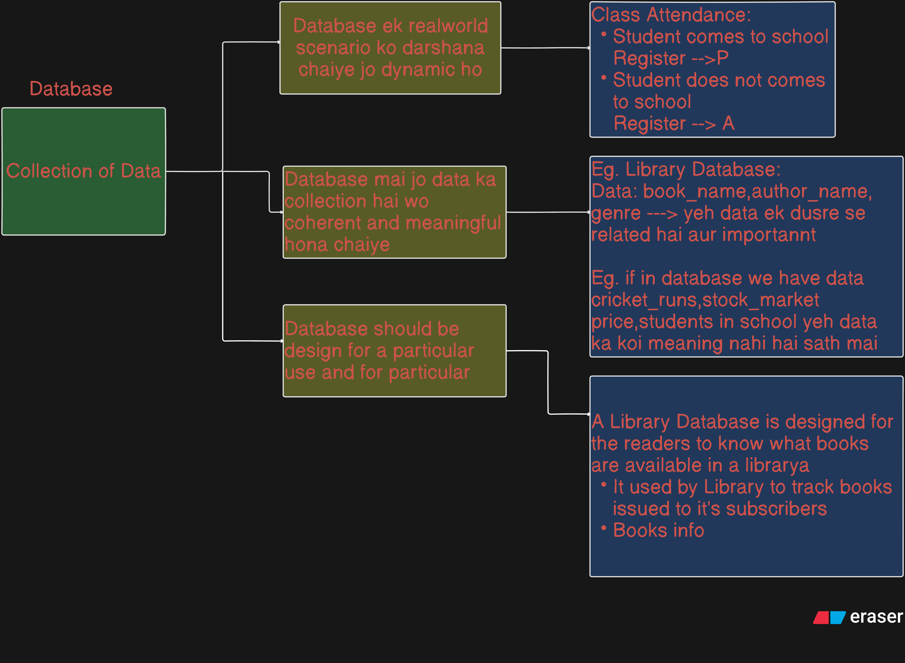

# **<span style="color:orange">Lesson-1 DBMS</span>**

## <span style="color:pink">What is Database?</span>

- A database is an organized collection of data that is stored and managed electronically.
- Databases are designed to efficiently store, retrieve, manage, and update data, making it accessible for various applications

## <span style="color:pink">3 Important Properties of a Database</span>



---

### 💬 Statement 1:

> **A database represents some aspect of the real world (called the miniworld or Universe of Discourse). Changes in the real world are reflected in the database.**

#### ✅ Simple Explanation:

A database is like a **mirror** of a specific part of the real world.

#### 🧠 Analogy:

Think of a **class attendance register** that a teacher uses.

- The real-world situation: Students come to school, attend or miss classes.
- The database (register): Tracks who was present or absent.

If a student is absent, the register marks it. So changes in the **real world (miniworld)** are updated in the **database (register)**.

#### 📘 Example:

A hospital database stores info about patients. If a new patient is admitted, their data is added. If a patient is discharged, it's updated.

---

### 💬 Statement 2:

> **A database is a logically coherent collection of data with some inherent meaning. A random assortment of data is not a database.**

#### ✅ Simple Explanation:

A database **makes sense as a whole**. It's not just a pile of random facts — everything in it is **related and meaningful**.

#### 🧠 Analogy:

A **recipe book** is a logical collection of recipes. All data (ingredients, steps) is structured and makes sense together.

Compare this to a **shoebox full of random notes**, phone numbers, and food recipes — that’s not a database. It has no structure or common purpose.

#### 📘 Example:

A **library database** tracks books, authors, genres, and borrowers. All this data is connected and makes sense together.
But if you throw in cricket scores, student grades, and movie reviews into one system without structure — that’s not a valid database.

---

### 💬 Statement 3:

> **A database is designed, built, and populated with data for a specific purpose. It has an intended group of users and some planned uses.**

#### ✅ Simple Explanation:

A database is made with a clear **goal** and **target users** in mind. It is not accidental.

#### 🧠 Analogy:

A **school timetable** is made to organize classes for students and teachers. It has a purpose and a specific audience.
You don’t just write random class names in a notebook and call it a timetable — it has to serve a function.

#### 📘 Example:

An **e-commerce database** like Amazon’s:

- Designed for customers to browse and order products.
- Also for sellers to add items.
- Backend admins to manage inventory.

Each group uses it with a clear purpose.

---

### 🔁 Summary Table:

| Property             | Simple Meaning                     | Analogy                      | Example                                             |
| -------------------- | ---------------------------------- | ---------------------------- | --------------------------------------------------- |
| Represents miniworld | Mirrors the real world             | Attendance register          | Student attends class → register updated            |
| Logically coherent   | All data is related and structured | Recipe book vs. random notes | Library database with books, authors, and borrowers |
| Purpose-built        | Made for a specific job and users  | School timetable             | Amazon DB for shopping, inventory, customer records |

---

### <span style="color:#33ff00">Importance of Databases</span>

- **Data Organization**: Provides a structured way to store and retrieve data.
- **Efficiency**: Allows for quick access and manipulation of large datasets.
- **Data Security**: Ensures only authorized users can access sensitive information.
- **Scalability**: Handles growing amounts of data efficiently.
- **Backup and Recovery**: Protects data from loss or corruption.

### <span style="color:#33ff00">Common Database Use Cases</span>

- **Web Applications**: User accounts, e-commerce inventory.
- **Financial Systems**: Transaction records, account balances.
- **Healthcare**: Patient records, appointment scheduling.
- **Data Analytics**: Aggregating and analyzing large datasets.

## <span style="color:pink">**DBMS and it's Role**</span>

## 🔷 **What is a DBMS?**

> **DBMS (Database Management System)** is a software system that allows users to **define**, **create**, **manipulate**, and **manage** databases efficiently while ensuring **security**, **concurrency**, and **data integrity**.

It acts as a **bridge** between the raw data and the user or application accessing the data.

---

## 🛠️ **5 Important Roles of a DBMS**

---

### 1. 🔹 **Defining the Database**

#### 📖 What It Means:

- Describes what kind of data will be stored.
- Specifies the structure using **schemas**, **tables**, **data types**, and **relationships**.

#### 💡 Example:

When creating a **Student Database**, you define:

- Table: `Student`
- Fields: `Name`, `Roll_No`, `Age`, `Course`, `Marks`
- Types: `Name` is text, `Age` is integer, etc.

#### ✅ Why Important:

Without defining structure, the data would be meaningless and inconsistent.

---

### 2. 🔹 **Constructing the Database**

#### 📖 What It Means:

- Physically creates and stores the data according to the definition.
- Handles how data is stored in memory (files, blocks, indexing, etc.)

#### 💡 Example:

After defining `Student` table, DBMS **creates the actual table in memory**, ready to store student records.

#### ✅ Why Important:

You need a working system to store and retrieve the defined data format.

---

### 3. 🔹 **Manipulating the Database**

#### 📖 What It Means:

- Allows users to perform **CRUD operations**:
  - **C**reate (Insert)
  - **R**ead (Query)
  - **U**pdate
  - **D**elete

#### 💡 Example:

You can insert new students, update marks, delete dropout records, or search for toppers.

#### ✅ Why Important:

It makes the database **useful and dynamic**, not just a static store.

---

### 4. 🔹 **Sharing the Database**

#### 📖 What It Means:

- Supports multiple users **accessing the database at the same time**.
- Manages **concurrency** to avoid conflicts and ensures data consistency.

#### 💡 Example:

In a school, the admin updates records while teachers view marks and students check results — **simultaneously**.

#### ✅ Why Important:

Modern systems are used by many people or apps at once. DBMS ensures **smooth, conflict-free access**.

---

### 5. 🔹 **Protecting and Securing the Database**

#### 📖 What It Means:

- Ensures that **only authorized users** can access or modify data.
- Enforces **security policies**, **authentication**, and **data privacy**.
- Includes backup, recovery, and data integrity rules.

#### 💡 Example:

- Students can **view** their marks but **not change** them.
- Only admins can delete records.
- Backup ensures data isn’t lost if system crashes.

#### ✅ Why Important:

Sensitive data like marks, salaries, or personal info must be **safe from tampering and loss**.

---

### 🔁 Summary Table:

| Role             | Description                      | Example                                 |
| ---------------- | -------------------------------- | --------------------------------------- |
| **Defining**     | Set structure & format           | Table `Student` with name, age, roll no |
| **Constructing** | Physically build storage         | Create tables in memory/disk            |
| **Manipulating** | Perform CRUD operations          | Insert/update student records           |
| **Sharing**      | Allow multi-user access          | Admin + Teachers + Students use system  |
| **Protecting**   | Security, access control, backup | Only authorized users edit/view         |

### Short Note:

- DBMS ek software hai jo Database ko define,physicall store krne,share krne,usse data ko use krne (using query),data ko protect and maintain rkhne ke liye use hota hai

---

## <span style="color:pink">Key Components of a Database</span>

### **1. Data**

- **Definition**: The raw information stored in the database.
- **Example**: In a library database:
  - Data could include book titles, author names, publication years, ISBN numbers, etc.
  - Sample data:
    - Book Title: _"To Kill a Mockingbird"_
    - Author: _Harper Lee_
    - ISBN: _978-0-06-112008-4_
    - Publication Year: _1960_

### **2. Database Management System (DBMS)**

- **Definition**: Software that provides tools for interacting with the database to perform operations like storing, retrieving, updating, and deleting data.
- **Example**:
  - MySQL, PostgreSQL, MongoDB, Oracle Database.
- **Role**:
  - Manages access control to ensure only authorized users can interact with data.
  - Optimizes query performance for faster data retrieval.

### **3. Schema**

- **Definition**: The structure or blueprint of the database that defines how data is organized, including tables, fields, data types, and relationships.
- **Example**: In an **Employee Database**, a schema could define:
  - **Tables**:
    - Employees: Contains employee details like ID, Name, Department, and Salary.
    - Departments: Contains department details like Department ID and Name.
  - **Relationships**:
    - The `Employees` table has a `Department_ID` field that relates to the `Departments` table.

```sql
CREATE TABLE Employees ( Employee_ID INT PRIMARY KEY, Name VARCHAR(50), Department_ID INT, Salary DECIMAL(10, 2), FOREIGN KEY (Department_ID) REFERENCES Departments(Department_ID) );
```

### **4. Query Language**

- **Definition**: The language used to interact with the database to retrieve, insert, update, or delete data.
- **Example**:
  - **SQL** (Structured Query Language) for relational databases.
  - Query to fetch all employees earning more than $50,000:

```sql
SELECT Name, Salary FROM Employees WHERE Salary > 50000;
```

### **5. Tables**

- **Definition**: The basic unit of storage in a relational database, consisting of rows and columns.
- **Example**: A **Products** table in an e-commerce database:
  | Product_ID|Product_Name|Price|Category|
  |--------|------------|-----------|-----|
  |101|Laptop|50000|Electronics|
  |102|Smartphone|20000|Electronics|
  |103|Blender|3000|Home|

### **6. Primary Key**

- **Definition**: A unique identifier for each record in a table.
- **Example**: In the **Products** table above, `Product_ID` serves as the primary key.

### **7. Foreign Key**

- **Definition**: A field in one table that links to the primary key in another table to establish relationships.
- **Example**: In an **Orders** table, the `Product_ID` field references the `Product_ID` in the **Products** table.

```sql
CREATE TABLE Orders ( Order_ID INT PRIMARY KEY, Product_ID INT, Quantity INT, FOREIGN KEY (Product_ID) REFERENCES Products(Product_ID) );
```

### **8. Index**

- **Definition**: A data structure that improves the speed of data retrieval.
- **Example**: Creating an index on the `Product_Name` column for faster searches:

```sql
CREATE INDEX idx_product_name ON Products(Product_Name);
```

### **9. Users and Roles**

- **Definition**: Define who can access the database and what actions they are authorized to perform.
- **Example**:
  - User roles like **Admin** (full access) or **Viewer** (read-only).
  - Granting read-only access to a user:

```sql
GRANT SELECT ON Products TO 'read_only_user;
```

### **10. Transactions**

- **Definition**: A sequence of operations performed as a single unit of work, ensuring consistency and reliability.
- **Example**: Transferring money between two bank accounts:
  1.  Deduct amount from Account A.
  2.  Add the same amount to Account B.
  3.  Ensure both operations succeed; otherwise, rollback.

```sql
BEGIN TRANSACTION; UPDATE Accounts SET Balance = Balance - 100 WHERE Account_ID = 1; UPDATE Accounts SET Balance = Balance + 100 WHERE Account_ID = 2; COMMIT;
```

### **11. Backup and Recovery**

- **Definition**: Mechanisms to protect and restore data in case of failure or data corruption.
- **Example**:
  - Periodically taking backups of a database to an external server.
  - Restoring the latest backup after a system crash.

---

# <span style="color: orange;">File System vs. Database</span>

## <span style="color: pink;">Definition</span>

A **File System** and a **Database** are two distinct methods for storing, organizing, and managing data. While they serve similar purposes, their functionalities, performance, and use cases differ significantly.

| Aspect     | File System                                                                                    | Database                                                                                            |
| ---------- | ---------------------------------------------------------------------------------------------- | --------------------------------------------------------------------------------------------------- |
| Definition | A method of storing and organizing data as files on storage devices (e.g., hard drives, SSDs). | A structured system designed to store, retrieve, and manage data using specialized software (DBMS). |

## <span style="color: pink;">Structure</span>

| Aspect            | File System                                                  | Database                                                                       |
| ----------------- | ------------------------------------------------------------ | ------------------------------------------------------------------------------ |
| Data Organization | Files and directories are used to organize data.             | Data is organized into tables, rows, and columns based on a schema.            |
| Relationships     | No inherent mechanism to manage relationships between files. | Supports relationships between data entities (e.g., primary and foreign keys). |

## <span style="color: pink;">Data Access and Retrieval</span>

| Aspect           | File System                                               | Database                                                        |
| ---------------- | --------------------------------------------------------- | --------------------------------------------------------------- |
| Access Speed     | Slower, especially for large datasets or complex queries. | Faster due to indexing, query optimization, and caching.        |
| Search Mechanism | Requires manual searching or custom-built logic.          | Uses a query language (e.g., SQL) for efficient data retrieval. |
| Data Redundancy  | Higher; duplicates are common without extra measures.     | Lower due to normalization and constraints.                     |

## <span style="color: pink;">Scalability and Performance</span>

| Aspect      | File System                                         | Database                                                        |
| ----------- | --------------------------------------------------- | --------------------------------------------------------------- |
| Scalability | Limited; managing large datasets can be cumbersome. | Highly scalable; designed to handle large and complex datasets. |
| Performance | Decreases as data size grows.                       | Maintains performance due to indexing and optimization.         |

## <span style="color: pink;">Data Integrity and Consistency</span>

| Aspect         | File System                                                        | Database                                                                       |
| -------------- | ------------------------------------------------------------------ | ------------------------------------------------------------------------------ |
| Data Integrity | Relies on user or application logic to maintain integrity.         | Ensures data integrity through constraints, transactions, and ACID properties. |
| Consistency    | Harder to ensure; changes in one file might not reflect in others. | Ensures consistency with schema enforcement and relational integrity.          |

## <span style="color: pink;">Security</span>

| Aspect         | File System                                    | Database                                                                  |
| -------------- | ---------------------------------------------- | ------------------------------------------------------------------------- |
| Access Control | Basic; relies on operating system permissions. | Advanced; role-based access control, user authentication, and encryption. |
| Data Backup    | Manual or external tools required.             | Built-in mechanisms for automated backups and recovery.                   |

## <span style="color: pink;">Use Cases and Transaction Management</span>

| Aspect          | File System                                                     | Database                                                                                             |
| --------------- | --------------------------------------------------------------- | ---------------------------------------------------------------------------------------------------- |
| Ideal Use Cases | Simple, unstructured data storage like images, videos, or logs. | Structured, relational, or complex data applications like inventory systems, banking, or e-commerce. |
| Transactions    | No built-in support for managing atomic transactions.           | Supports atomicity, consistency, isolation, and durability (ACID).                                   |
| Example         | A folder containing `.txt` files with product details.          | A MySQL database with a `Products` table storing product details.                                    |

## <span style="color: pink;">Advantages and Disadvantages</span>

### File System

**Advantages:**

1. Simple and easy to use for basic storage needs.
2. Requires no specialized software.
3. Suitable for storing unstructured data like images or logs.

**Disadvantages:**

1. Lacks advanced querying capabilities.
2. Difficult to maintain data consistency.
3. Harder to scale and manage large datasets.

### Database

**Advantages:**

1. Efficient querying and data retrieval.
2. Built-in support for relationships, transactions, and scalability.
3. Better for maintaining data consistency and integrity.

**Disadvantages:**

1. Requires additional setup and maintenance.
2. Can be complex for simple storage tasks.
3. Higher initial cost for hardware and software.

## <span style="color:pink">Database Approach in Detail vs File-based Approach</span>

Excellent! Let's explain the **main characteristics of the database approach** versus the traditional **file-processing approach**, with simple explanations, analogies, and examples.

---

## ✅ **1. Self-Describing Nature of a Database System**

### 🔹 Key Ideas:

- A **database stores not only the data**, but also **metadata**—data about the data.
- This metadata is stored in a **catalog**, also called the **data dictionary**.
- The system can use this metadata to understand the structure, types, and relationships.

### 📖 Explanation:

In file-based systems, programs need to know how to interpret the file (structure is external).
But in databases, the **DBMS knows everything about the structure**, so programs don't need to be hardcoded.

### 📚 Metadata:

- Describes tables, columns, data types, relationships, constraints.

### 📘 Cataloging:

- A special place in DBMS that **stores metadata**. It lets the DBMS or any authorized program understand the structure without manual input.

---

### 🧠 Analogy:

Imagine a **library** where each book includes a page at the beginning describing:

- Number of chapters
- Subject
- Author info
  This is like **metadata** in a **catalog** — it tells you about the book **before reading it**.

In contrast, in file-processing, there’s no such page. You must **read the entire file** and interpret it yourself.

---

### 📌 Example:

- In **MySQL**, `information_schema` is a catalog that stores all table definitions, column types, constraints, etc.
- You can query it like:

  ```sql
  SELECT * FROM information_schema.tables;
  ```

---

## ✅ **2. Insulation Between Programs and Data, and Data Abstraction**

### 🔹 Key Concepts:

- **Program-Data Independence**: Changes in data structure do not require rewriting all application programs.
- **Data Abstraction**: Users don’t see raw storage, only what they need (abstract view).

---

### 📖 Explanation:

In file-processing:

- If you change the file format (e.g., add a new column), **all programs break** and must be updated.

In DBMS:

- Applications are insulated from such changes.
- The structure is handled by the DBMS, so programs use **queries**, not raw file parsing.

---

### 🧠 Analogy:

Imagine plugging your **charger into a wall socket**.

- Whether the electricity is coming from a generator, solar panel, or grid — your phone doesn't care.
- That’s **abstraction**. The **socket interface** doesn’t change when the backend does.

---

### 📌 Example:

In a **university database**:

- You add a new field `BloodGroup` to the `Student` table.
- The application that only fetches `Name` and `RollNo` **doesn’t break** because it’s insulated.

---

## ✅ **3. Support of Multiple Views of the Data**

### 📖 Explanation:

Different users need to see **different versions (views)** of the same data.

- A **view** is a customized logical representation of the data.
- It does **not store separate data**—just presents it differently.

---

### 🧠 Analogy:

Imagine a **Google Sheet**:

- Admin sees full marks + attendance.
- Student sees only their marks.
- Teacher sees subject-wise performance.

Same data, but each sees only **what’s relevant**.

---

### 📌 Example:

A `Bank` database:

- Customer sees balance & transactions.
- Teller sees customer profile & account status.
- Manager sees summary reports.

SQL View:

```sql
CREATE VIEW student_view AS
SELECT Name, RollNo FROM Student;
```

---

## ✅ **4. Sharing of Data and Multiuser Transaction Processing**

### 🔹 Key Concepts:

- **Data Sharing**: Many users/apps access the same database.
- **Concurrency Control**: Ensures correct results when many users access the same data.
- **Transaction Management**: Ensures atomic, consistent, isolated, and durable (ACID) operations.
- **OLTP (Online Transaction Processing)**: High-volume, real-time transactions (banking, reservations).

---

### 📖 Explanation:

File-processing systems struggle with **multi-user conflicts**.
In DBMS:

- Multiple users can **safely read and write**.
- DBMS ensures **data is consistent** (no double withdrawals, no lost updates).

---

### 🧠 Analogy:

Think of an **online railway booking system**:

- 10 people try to book 1 seat at once.
- DBMS ensures only 1 gets the seat. Others see "Booked".

---

### 📌 Example:

- In a **banking DB**, two users transferring money at the same time won't corrupt balances.
- **Transaction** in SQL:

  ```sql
  BEGIN;
  UPDATE Account SET Balance = Balance - 100 WHERE AccNo = 'A1';
  UPDATE Account SET Balance = Balance + 100 WHERE AccNo = 'A2';
  COMMIT;
  ```

---

## 🔁 Summary Table:

| Feature                      | Description                | Analogy                          | Example                               |
| ---------------------------- | -------------------------- | -------------------------------- | ------------------------------------- |
| **Self-describing**          | Metadata stored in catalog | Book with a summary page         | `information_schema`                  |
| **Insulation & abstraction** | Program-data independence  | Wall socket & electricity source | Add column without breaking app       |
| **Multiple views**           | Custom views for users     | Google Sheet with filters        | `CREATE VIEW` in SQL                  |
| **Sharing & transactions**   | Multi-user, ACID, OLTP     | Online ticket booking            | Bank transfer with `BEGIN` & `COMMIT` |

---

Let me know if you'd like this in `.md` syntax for your notes or as a visual chart!

---

## ✅ **1. Self-Describing Nature of a Database System**

### 🔹 Key Ideas:

- A **database stores not only the data**, but also **metadata**—data about the data.
- This metadata is stored in a **catalog**, also called the **data dictionary**.
- The system can use this metadata to understand the structure, types, and relationships.

### 📖 Explanation:

In file-based systems, programs need to know how to interpret the file (structure is external).
But in databases, the **DBMS knows everything about the structure**, so programs don't need to be hardcoded.

### 📚 Metadata:

- Describes tables, columns, data types, relationships, constraints.

### 📘 Cataloging:

- A special place in DBMS that **stores metadata**. It lets the DBMS or any authorized program understand the structure without manual input.

---

### 🧠 Analogy:

Imagine a **library** where each book includes a page at the beginning describing:

- Number of chapters
- Subject
- Author info
  This is like **metadata** in a **catalog** — it tells you about the book **before reading it**.

In contrast, in file-processing, there’s no such page. You must **read the entire file** and interpret it yourself.

---

### 📌 Example:

- In **MySQL**, `information_schema` is a catalog that stores all table definitions, column types, constraints, etc.
- You can query it like:

  ```sql
  SELECT * FROM information_schema.tables;
  ```

---

## ✅ **2. Insulation Between Programs and Data, and Data Abstraction**

### 🔹 Key Concepts:

- **Program-Data Independence**: Changes in data structure do not require rewriting all application programs.
- **Data Abstraction**: Users don’t see raw storage, only what they need (abstract view).

---

### 📖 Explanation:

In file-processing:

- If you change the file format (e.g., add a new column), **all programs break** and must be updated.

In DBMS:

- Applications are insulated from such changes.
- The structure is handled by the DBMS, so programs use **queries**, not raw file parsing.

---

### 🧠 Analogy:

Imagine plugging your **charger into a wall socket**.

- Whether the electricity is coming from a generator, solar panel, or grid — your phone doesn't care.
- That’s **abstraction**. The **socket interface** doesn’t change when the backend does.

---

### 📌 Example:

In a **university database**:

- You add a new field `BloodGroup` to the `Student` table.
- The application that only fetches `Name` and `RollNo` **doesn’t break** because it’s insulated.

---

## ✅ **3. Support of Multiple Views of the Data**

### 📖 Explanation:

Different users need to see **different versions (views)** of the same data.

- A **view** is a customized logical representation of the data.
- It does **not store separate data**—just presents it differently.

---

### 🧠 Analogy:

Imagine a **Google Sheet**:

- Admin sees full marks + attendance.
- Student sees only their marks.
- Teacher sees subject-wise performance.

Same data, but each sees only **what’s relevant**.

---

### 📌 Example:

A `Bank` database:

- Customer sees balance & transactions.
- Teller sees customer profile & account status.
- Manager sees summary reports.

SQL View:

```sql
CREATE VIEW student_view AS
SELECT Name, RollNo FROM Student;
```

---

## ✅ **4. Sharing of Data and Multiuser Transaction Processing**

### 🔹 Key Concepts:

- **Data Sharing**: Many users/apps access the same database.
- **Concurrency Control**: Ensures correct results when many users access the same data.
- **Transaction Management**: Ensures atomic, consistent, isolated, and durable (ACID) operations.
- **OLTP (Online Transaction Processing)**: High-volume, real-time transactions (banking, reservations).

---

### 📖 Explanation:

File-processing systems struggle with **multi-user conflicts**.
In DBMS:

- Multiple users can **safely read and write**.
- DBMS ensures **data is consistent** (no double withdrawals, no lost updates).

---

### 🧠 Analogy:

Think of an **online railway booking system**:

- 10 people try to book 1 seat at once.
- DBMS ensures only 1 gets the seat. Others see "Booked".

---

### 📌 Example:

- In a **banking DB**, two users transferring money at the same time won't corrupt balances.
- **Transaction** in SQL:

  ```sql
  BEGIN;
  UPDATE Account SET Balance = Balance - 100 WHERE AccNo = 'A1';
  UPDATE Account SET Balance = Balance + 100 WHERE AccNo = 'A2';
  COMMIT;
  ```

---

## 🔁 Summary Table:

| Feature                      | Description                | Analogy                          | Example                               |
| ---------------------------- | -------------------------- | -------------------------------- | ------------------------------------- |
| **Self-describing**          | Metadata stored in catalog | Book with a summary page         | `information_schema`                  |
| **Insulation & abstraction** | Program-data independence  | Wall socket & electricity source | Add column without breaking app       |
| **Multiple views**           | Custom views for users     | Google Sheet with filters        | `CREATE VIEW` in SQL                  |
| **Sharing & transactions**   | Multi-user, ACID, OLTP     | Online ticket booking            | Bank transfer with `BEGIN` & `COMMIT` |

---

## <span style="color: pink;">When to Use Which?</span>

| Scenario                                                        | Recommended |
| --------------------------------------------------------------- | ----------- |
| Simple data storage without relationships                       | File System |
| Managing structured data with relationships                     | Database    |
| Storing large, unstructured files (e.g., images, videos)        | File System |
| Applications needing fast queries, consistency, and reliability | Database    |

# <span style="color: orange;">Database Fundamentals: Integrity, Isolation, and Atomicity</span>

## <span style="color: pink;">Data Integrity</span>

**Definition**: Data integrity ensures that the data in a database is accurate, consistent, and reliable throughout its lifecycle. It prevents unauthorized access, accidental modifications, or corruption.

**Key Aspects**:

- **Accuracy**: Data is correct and free from errors.
- **Consistency**: Data remains uniform across the database.
- **Validation**: Rules ensure only valid data is entered (e.g., setting constraints).

**Example**:

- **Scenario**: A university database stores student grades. The **"Grade"** column accepts values between 0 and 100.
  - If someone tries to enter `105`, the system rejects it because of a **validation rule**.
  - If a student ID `101` is enrolled in "Math," that enrollment must not conflict with other records.

## <span style="color: pink;">Data Isolation</span>

**Definition**: Data isolation ensures that concurrent transactions do not interfere with each other. Each transaction is processed as if it's the only one happening, maintaining database consistency.

**Example**:

- **Scenario**: Two bank customers, A and B, use an ATM simultaneously:
  - **Customer A** withdraws $500.
  - **Customer B** transfers $1000 to another account.
  - **Without isolation**: If both transactions happen at the same time, their effects could mix, causing errors like incorrect account balances.
  - **With isolation**: Each transaction is processed independently, so the final balances are correct.

## <span style="color: pink;">Atomicity</span>

**Definition**: Atomicity ensures that a transaction is **all or nothing**. Either the entire transaction completes successfully, or no part of it takes effect. This prevents partial updates in case of errors or failures.

**Example**:

- **Scenario**: A bank transfer:
  - **Step 1**: Debit $500 from Account A.
  - **Step 2**: Credit $500 to Account B.
  - **Without atomicity**: If the system crashes after Step 1 but before Step 2, Account A loses $500, and Account B doesn't receive it.
  - **With atomicity**: Both steps are treated as a single unit. If Step 2 fails, Step 1 is rolled back, leaving both accounts unchanged.

## <span style="color: pink;">Summary Table</span>

| Feature        | Definition                                                 | Example                                                                                               |
| -------------- | ---------------------------------------------------------- | ----------------------------------------------------------------------------------------------------- |
| Data Integrity | Ensures accuracy, consistency, and reliability of data.    | Restricting grades to values between 0 and 100 in a university database.                              |
| Data Isolation | Ensures transactions do not interfere with each other.     | Processing simultaneous bank transactions independently to avoid mixed outcomes.                      |
| Atomicity      | Guarantees a transaction is fully completed or not at all. | Ensuring that both debit and credit steps in a bank transfer succeed or the entire transaction fails. |
